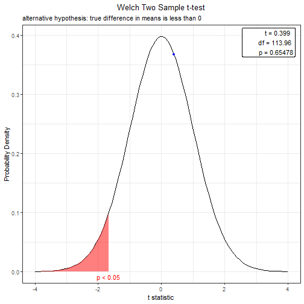

Can We Trust the 10th Day of the 10-Day Forecast?
========================================================
author:  Alex Baburnic, Nate Hansen, & David Vanegas
date: 4/22/2022
autosize: true

For more details on authoring R presentations please visit <https://support.rstudio.com/hc/en-us/articles/200486468>.

The Questions
========================================================
autosize: true

1. In Salt Lake City, is the 7th day of the local KSL weather forecast more or less accurate than the 7th day of the forecast provided by the U. S. National Weather Service?

2. Of the cities Salt Lake City, UT; Austin, TX; San Francisco, CA; New York, NY; and Chicago, IL; which city's 10th forecast day is, on average, closest to the actual temperature that day?

3. Does the city with the "most accurate" forecast according to question 2 also have the least variability in temperature over the month of March?

Forecast Data
========================================================
autosize: true

We collected 10 days of forecast data twice a day from the following cities:

- Salt Lake City, UT (KSL and The Weather Channel)
- Austin, TX
- San Francisco, CA
- New York, NY
- Chicago, IL

These cities were chosen because they are large metropolitan areas, and because they have relatively different climates. We figured that the national algorithm would probably provide its most accurate service to large cities, and it would be another question entirely to consider small towns.

Data was collected at 7:00am and 5:00pm Mountain Time. We understand that this is systematic and not random, but since forecasts are only updated periodically, we have captured the updates.

Question 1: In Salt Lake City, is the seventh day of the local KSL weather forecast more or less accurate than the seventh day of the forecast provided by The Weather Channel?
========================================================
autosize: true

The null hypothesis is given as follows:

$H_0:\bar{x}_{KSLerr}-\bar{x}_{WCHNerr} >= 0$

$H_a:\bar{x}_{KSLerr} - \bar{x}_{WCHNerr} < 0$


First, the complete difference data for both services can be tested against the null hypothesis using a Welch Two Sample t-test.

```

	Welch Two Sample t-test

data:  c(KSL_lo_forecast_diff, KSL_hi_forecast_diff) and c(SLC_lo_forecast_diff, SLC_hi_forecast_diff)
t = 0.39928, df = 113.96, p-value = 0.6548
alternative hypothesis: true difference in means is less than 0
95 percent confidence interval:
     -Inf 2.043557
sample estimates:
mean of x mean of y 
1.3103448 0.9137931 
```

Question 1 (Cont'd)
========================================================



Question 2
========================================================


